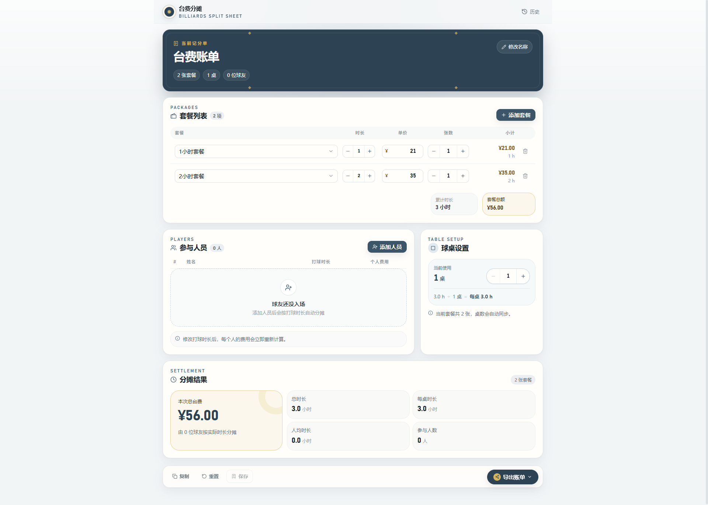
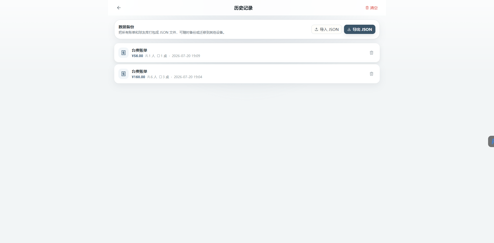
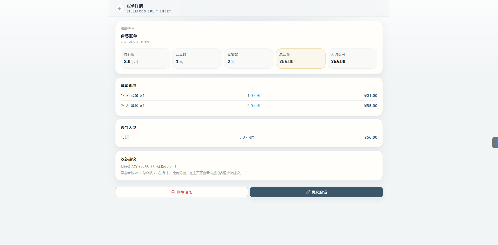
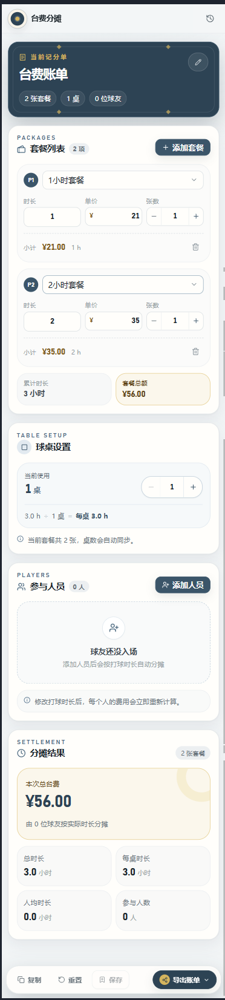
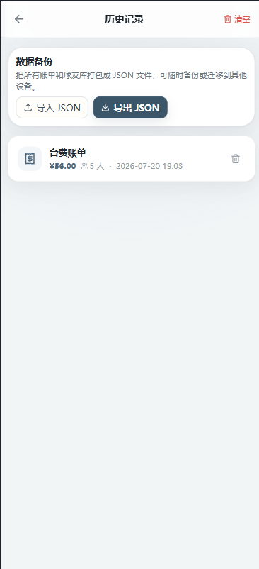
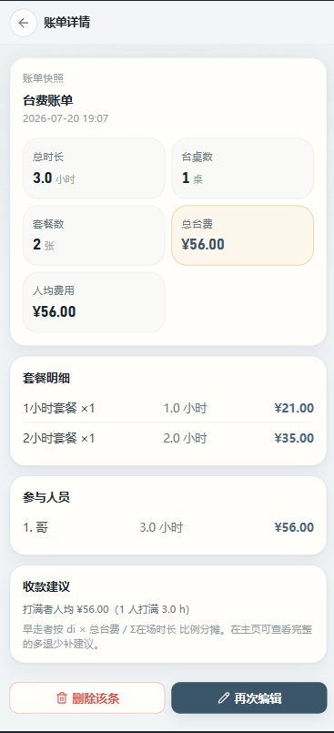

# 台球 A 台费分摊系统

> 一个面向多人拼场场景的台费 + 时长自动分摊前端系统。

## 项目预览

### PC 端

#### 首页



#### 历史账单



#### 账单详情



### 手机端

<table>
  <thead>
    <tr>
      <th>首页</th>
      <th>历史账单</th>
      <th>账单详情</th>
    </tr>
  </thead>
  <tbody>
    <tr>
      <td></td>
      <td></td>
      <td></td>
    </tr>
  </tbody>
</table>

## 技术栈

- TypeScript + Vite + Vue 3
- Tailwind CSS
- Pinia + Vue Router
- Lucide Icons + Dayjs + Clsx
- Axios（基础封装，方便后续接入后端）
- IndexedDB（idb）— 历史账单持久化

## 启动

```bash
npm install
npm run dev
```

构建：

```bash
npm run build
npm run preview
```

## 功能

- 台费设置（桌号 / 单价 / 开始时间）
- 参与人员管理（增删 / 时长调节 / 姓名自定义）
- 一键平摊 + 收款建议（多退少补，自动处理尾差）
- 导出账单 / 分享账单
- 历史记录（IDB 持久化）
- 响应式：PC + 移动端均可用

详细方案见 `billiards-splitter-plan.md`。